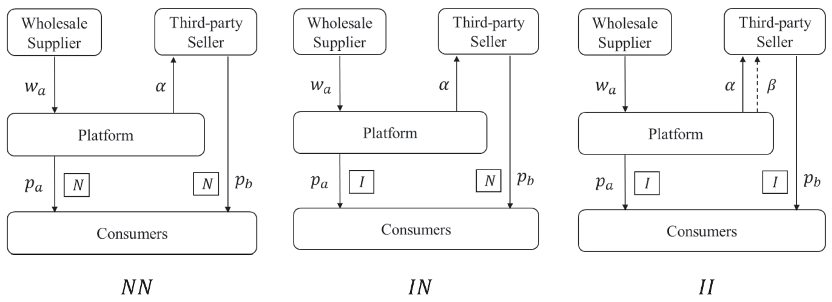

# Research Details

## Market Setting

The model considers a hybrid e-commerce market consisting of a wholesale supplier, a platform, a third-party seller, and a continuum of consumers. The platform purchases product A from the wholesale supplier and resells it to consumers, while the third-party seller sells a substitute product B directly through the platform.

The seller pays the platform a commission rate \(\alpha\). If the platform shares its consumer credit service with the seller, the seller also pays an additional service-fee rate \(\beta\). Consumer credit increases consumers' willingness to pay, but the platform bears losses associated with non-repayment.

## Operational Modes

{ width="100%" }

*Figure 1. No credit service (NN), exclusive provision by the platform (IN), and service sharing with the third-party seller (II).*

| Mode | Platform's product A | Seller's product B |
|---|---|---|
| **NN** | No consumer credit service | No consumer credit service |
| **IN** | Consumer credit service provided | No consumer credit service |
| **II** | Consumer credit service provided | Consumer credit service shared |

## Model Notation

For compact presentation, the notation is arranged in paired columns. The superscript \(k\in\{NN,IN,II\}\) denotes the operational mode, and the subscript \(i\in\{W,T,P\}\) denotes the wholesale supplier, third-party seller, and platform.

| Symbol | Meaning | Symbol | Meaning |
|---|---|---|---|
| \(v\) | Consumer valuation of product A | \(\lambda\) | Product differentiation between A and B |
| \(p_a^k\) | Retail price of product A | \(p_b^k\) | Retail price of product B |
| \(w_a^k\) | Wholesale price of product A | \(D_a^k,D_b^k\) | Demands for products A and B |
| \(\alpha\) | Platform commission rate | \(\beta\) | Credit-service fee charged to the seller |
| \(\gamma\) | Consumer preference for the credit service | \(\theta\) | Consumer repayment rate |
| \(\pi_i^k\) | Profit of market participant \(i\) | \(CS^k\) | Consumer surplus |
| \(\delta\) | Share of consumers willing to use credit | \(1-\delta\) | Share of conservative consumers in the extension |

The base model assumes \(v\sim U[0,1]\), \(0<\lambda<1\), \(0<\alpha<1/5\), \(0<\beta<1/10\), and \(1/2<\theta<1\).

## Consumer Utilities and Demands

### NN Mode

Neither channel offers consumer credit:

\[
\begin{aligned}
u_a^{NN} &= v-p_a^{NN},
&u_b^{NN} &= \lambda v-p_b^{NN},\\
D_a^{NN} &= 1-\frac{p_a^{NN}-p_b^{NN}}{1-\lambda},
&D_b^{NN} &= \frac{p_a^{NN}-p_b^{NN}}{1-\lambda}
-\frac{p_b^{NN}}{\lambda}.
\end{aligned}
\]

### IN Mode

Only the platform's product offers consumer credit:

\[
\begin{aligned}
u_a^{IN} &= v-p_a^{IN}+\gamma p_a^{IN},
&u_b^{IN} &= \lambda v-p_b^{IN},\\
D_a^{IN} &= 1-\frac{(1-\gamma)p_a^{IN}-p_b^{IN}}{1-\lambda},
&D_b^{IN} &= \frac{(1-\gamma)p_a^{IN}-p_b^{IN}}{1-\lambda}
-\frac{p_b^{IN}}{\lambda}.
\end{aligned}
\]

### II Mode

Both products offer the platform's consumer credit service:

\[
\begin{aligned}
u_a^{II} &= v-p_a^{II}+\gamma p_a^{II},
&u_b^{II} &= \lambda v-p_b^{II}+\gamma p_b^{II},\\
D_a^{II} &= 1-\frac{(1-\gamma)(p_a^{II}-p_b^{II})}{1-\lambda},
&D_b^{II} &= \frac{(1-\gamma)(p_a^{II}-p_b^{II})}{1-\lambda}
-\frac{(1-\gamma)p_b^{II}}{\lambda}.
\end{aligned}
\]

## Profit Functions

### NN Mode

\[
\begin{aligned}
\pi_W^{NN} &= w_a^{NN}D_a^{NN},\\
\pi_T^{NN} &= (1-\alpha)p_b^{NN}D_b^{NN},\\
\pi_P^{NN} &= (p_a^{NN}-w_a^{NN})D_a^{NN}
+\alpha p_b^{NN}D_b^{NN}.
\end{aligned}
\]

### IN Mode

\[
\begin{aligned}
\pi_W^{IN} &= w_a^{IN}D_a^{IN},\\
\pi_T^{IN} &= (1-\alpha)p_b^{IN}D_b^{IN},\\
\pi_P^{IN} &= (\theta p_a^{IN}-w_a^{IN})D_a^{IN}
+\alpha p_b^{IN}D_b^{IN}.
\end{aligned}
\]

### II Mode

\[
\begin{aligned}
\pi_W^{II} &= w_a^{II}D_a^{II},\\
\pi_T^{II} &= (1-\alpha-\beta)p_b^{II}D_b^{II},\\
\pi_P^{II} &= (\theta p_a^{II}-w_a^{II})D_a^{II}
+(\alpha+\beta)p_b^{II}D_b^{II}
-(1-\theta)p_b^{II}D_b^{II}.
\end{aligned}
\]

## Solution Method

The game is solved by backward induction:

1. The wholesale supplier chooses the wholesale price \(w_a^k\).
2. The platform and third-party seller simultaneously choose retail prices \(p_a^k\) and \(p_b^k\).
3. Consumers choose product A, product B, or no purchase.
4. Equilibrium prices, demands, profits, and consumer surplus are derived for each mode.
5. The equilibrium outcomes are compared to determine the platform's provision and sharing strategies.

The analysis combines analytical equilibrium derivation, comparative statics, and Mathematica-based numerical simulations.