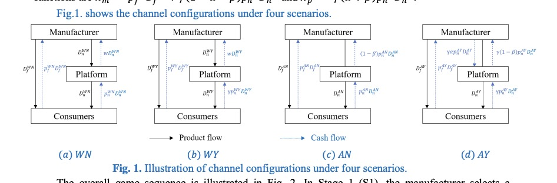

# Research Details

## Market Setting

The model considers a dual-channel supply chain consisting of a manufacturer, an e-commerce platform, and a continuum of consumers.

The manufacturer operates an offline channel and collaborates with the platform to establish an online channel:

- Under the **wholesale contract**, the platform purchases the product from the manufacturer and resells it online.
- Under the **agency contract**, the manufacturer sells directly through the platform and pays a commission fee.

Pay-on-delivery allows consumers to postpone payment until product receipt. The service reduces the online channel's delivery-delay disadvantage but also postpones firms' cash recovery.

## Operational Scenarios

{ width="100%" }

*Figure 1. Channel configurations under wholesale and agency contracts, with and without pay-on-delivery.*

| Scenario | Distribution contract | Payment scheme |
|---|---|---|
| **WN** | Wholesale | No pay-on-delivery |
| **WY** | Wholesale | Pay-on-delivery |
| **AN** | Agency | No pay-on-delivery |
| **AY** | Agency | Pay-on-delivery |

Under the wholesale contract, the platform independently decides whether to offer pay-on-delivery. Under the agency contract, implementation requires both the platform's willingness to offer the service and the manufacturer's willingness to adopt it.

## Model Notation

| Symbol | Meaning | Symbol | Meaning |
|---|---|---|---|
| \(v\) | Consumer valuation, \(v\sim U[0,1]\) | \(\theta\) | Valuation discount caused by delayed receipt |
| \(\gamma\) | Revenue discount caused by deferred cash recovery | \(\ell\) | Shopping-cost difference between offline and online channels |
| \(\alpha\) | Pay-on-delivery service-fee rate | \(\beta\) | Agency commission rate |
| \(p_f,p_n\) | Offline and online retail prices | \(w\) | Wholesale price |
| \(D_f,D_n\) | Offline and online demands | \(\pi_m,\pi_p\) | Manufacturer and platform profits |
| \(CS\) | Consumer surplus | \(SW\) | Social welfare |

## Consumer Utilities

Consumer utility from purchasing offline is

\[
u_f=v-p_f-\ell.
\]

Without pay-on-delivery, consumers pay when ordering but receive the product later:

\[
u_n^N=\theta v-p_n.
\]

With pay-on-delivery, both product receipt and payment occur later:

\[
u_n^Y=\theta(v-p_n).
\]

A lower \(\theta\) represents a more severe delivery-delay disadvantage. Pay-on-delivery improves the online channel by allowing consumers to postpone payment, but the selling firm receives discounted future revenue.

## Profit Structure

Under a wholesale contract, the manufacturer earns offline sales revenue and wholesale revenue, while the platform earns the online reselling margin:

\[
\begin{aligned}
\pi_m^{WN}
&=
p_f^{WN}D_f^{WN}+w^{WN}D_n^{WN},\\
\pi_p^{WN}
&=
\left(p_n^{WN}-w^{WN}\right)D_n^{WN},
\end{aligned}
\]

\[
\begin{aligned}
\pi_m^{WY}
&=
p_f^{WY}D_f^{WY}+w^{WY}D_n^{WY},\\
\pi_p^{WY}
&=
\left(\gamma p_n^{WY}-w^{WY}\right)D_n^{WY}.
\end{aligned}
\]

Under an agency contract, the manufacturer controls both retail prices and shares online revenue with the platform:

\[
\begin{aligned}
\pi_m^{AN}
&=
p_f^{AN}D_f^{AN}
+(1-\beta)p_n^{AN}D_n^{AN},\\
\pi_p^{AN}
&=
\beta p_n^{AN}D_n^{AN},
\end{aligned}
\]

\[
\begin{aligned}
\pi_m^{AY}
&=
p_f^{AY}D_f^{AY}
+\gamma(1-\alpha-\beta)p_n^{AY}D_n^{AY},\\
\pi_p^{AY}
&=
\gamma(\alpha+\beta)p_n^{AY}D_n^{AY}.
\end{aligned}
\]

## Solution Method

The four scenarios are solved using backward induction. Equilibrium prices, channel demands, firm profits, consumer surplus, and social welfare are compared to determine:

1. whether pay-on-delivery is adopted;
2. how it changes online and offline channel outcomes; and
3. whether the manufacturer selects the wholesale or agency contract.

The analysis combines analytical equilibrium derivation, comparative statics, and Mathematica-based numerical analysis.