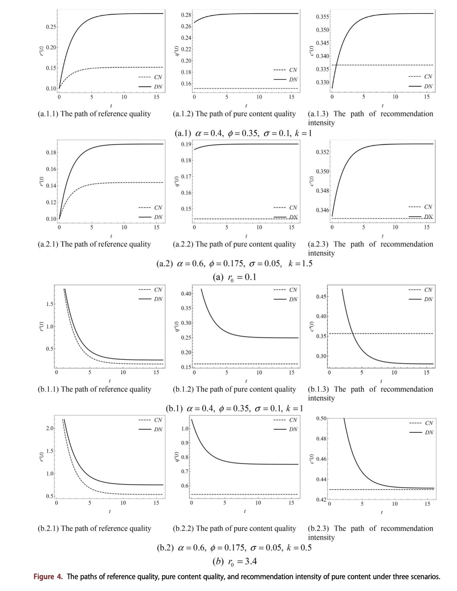

# Research Details

## Market Setting

The model considers a Stackelberg game between a UGC platform and a content creator.

The platform acts as the leader and determines the recommendation intensity of pure content, denoted by \(c(t)\). The remaining proportion, \(1-c(t)\), represents the recommendation intensity of shoppable content.

After observing the platform's decision, the content creator determines the quality of pure content, denoted by \(q(t)\).

Pure content helps attract and retain users, while shoppable content generates direct commercial revenue for the platform. The platform must therefore balance user engagement against commercial exposure.

## Decision Scenarios

{ width="100%" }

*Figure 1. Reference quality, pure-content quality, and recommendation intensity under static and dynamic decisions.*

| Scenario | Description |
|---|---|
| **CN** | Static content quality and recommendation intensity |
| **DN** | Dynamic decisions without reference-quality uncertainty |
| **DS** | Dynamic decisions with stochastic reference-quality uncertainty |

## Model Notation

| Symbol | Meaning | Symbol | Meaning |
|---|---|---|---|
| \(c(t)\) | Recommendation intensity of pure content | \(1-c(t)\) | Recommendation intensity of shoppable content |
| \(q(t)\) | Quality of pure content | \(r(t)\) | Consumer reference quality |
| \(N(t)\) | User engagement | \(N_0\) | Base level of user engagement |
| \(\alpha\) | Sensitivity to pure-content quality | \(\phi\) | Sensitivity to the reference-quality effect |
| \(\rho\) | Consumer aversion to shoppable content | \(b\) | Consumer memory-decay rate |
| \(n\) | Platform revenue per shoppable-content view | \(l\) | Creator revenue per pure-content view |
| \(k\) | Content-quality cost coefficient | \(\epsilon\) | Reference-quality uncertainty level |

## Reference Quality and User Engagement

Consumer reference quality evolves according to

\[
dr(t)=b\bigl(q(t)-r(t)\bigr)dt.
\]

Current content quality affects future user expectations. When current quality exceeds reference quality, users experience a positive reference effect; when it falls below reference quality, user engagement is negatively affected.

User engagement is modeled as

\[
N(t)
=
N_0
+\alpha q(t)
+\phi\bigl(q(t)-r(t)\bigr)
-\rho\bigl(1-c(t)\bigr).
\]

User engagement increases with pure-content quality and decreases with exposure to shoppable content.

## Profit Structure

The platform earns revenue from views of shoppable content:

\[
P_p(t)
=
nN(t)\bigl(1-c(t)\bigr).
\]

The content creator earns revenue from views of pure content and incurs a quadratic quality-production cost:

\[
P_c(t)
=
lN(t)c(t)-kq(t)^2.
\]

The platform therefore balances the engagement benefit of recommending pure content against the direct revenue generated by shoppable content.

## Reference-Quality Uncertainty

Under the stochastic scenario, reference quality follows

\[
dr(t)
=
b\bigl(q(t)-r(t)\bigr)dt
+
\epsilon\sqrt{r(t)}\,dW(t),
\]

where \(W(t)\) is a standard Brownian motion and \(\epsilon\) measures the uncertainty of consumer reference quality.

## Solution Method

The static scenario is solved through backward induction. The dynamic scenarios are analyzed using optimal control theory, dynamic programming, Hamilton–Jacobi–Bellman equations, and differential-game analysis.

Mathematica-based numerical simulations are used to compare the optimal paths and profits under the CN, DN, and DS scenarios.